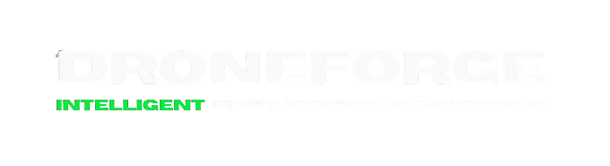

# DroneForge AI: Open-Source Intelligent Drone Technology




## 🚀 Introduction

Welcome to **DroneForge AI**, the ultimate open-source toolkit designed to transform the world of drone intelligence and deep learning. Our goal is to make advanced drone AI accessible to everyone, empowering developers, researchers, and innovators worldwide to create autonomous aerial systems that push the boundaries of technology.

## 🌟 Features

DroneForge AI offers a suite of tools and algorithms to take your drone projects to the next level:

- 🧠 **Cutting-Edge Computer Vision**:
  - **Object Classification**: Identify objects accurately in various environments.
  - **Object Detection**: Implement real-time detection with high precision and speed.
  - **Semantic Segmentation**: Understand and interpret complex scenes with pixel-level detail.
  - **Instance Segmentation**: Distinguish and analyze individual objects within a single view.

- 🗺️ **Advanced Navigation & Mapping**:
  - **SLAM (Simultaneous Localization and Mapping)**: Enable drones to navigate and map their surroundings autonomously.
  - **Depth Estimation Algorithms**: Get accurate distance measurements for smooth maneuvering.
  - **Path Planning**: Optimize flight routes with intelligent and adaptive planning.

- 🐝 **Next-Generation Swarm Intelligence**:
  - **Multi-Drone Coordination**: Manage complex missions with seamless multi-drone collaboration.
  - **Swarm Behavior Simulations**: Model and deploy sophisticated swarm dynamics for scalable operations.

- 🛠️ **Comprehensive Development Tools**:
  - **Real-Time 3D Simulation Environment**: Test and iterate your drone designs in a highly realistic virtual space.
  - **Customizable Drone Physics**: Adjust the physical behaviors of drones to match specific needs and scenarios.
  - **Extensible Plugin Architecture**: Easily integrate and expand functionalities with a modular plugin system.

## 🚀 Quick Start

Get started with DroneForge AI and unlock the full potential of intelligent drone development in just a few steps:

1. **Clone the Repository**
   ```bash
   git clone https://github.com/droneforge/droneforge-ai.git
   ```

2. **Navigate to the Project Directory**
   ```bash
   cd droneforge-ai
   ```

3. **Install Dependencies**
   ```bash
   npm install
   ```

4. **Start the Development Environment**
   ```bash
   npm start
   ```

## 🤝 Contributing

At DroneForge AI, we thrive on community-driven innovation. Whether you're fixing bugs, developing new features, or improving documentation, your contributions are invaluable to our mission.

We're currently working on establishing contribution licenses and guidelines!

## 📄 License

The license is still pending!

## 💡 Why Choose DroneForge AI?

At DroneForge AI, we're dedicated to shaping the future of aerial robotics through accessible, intelligent, and innovative systems. Our platform is designed to:

1. **Democratize Drone AI**: By offering open-source tools and cutting-edge algorithms, we make sophisticated drone intelligence attainable for everyone, not just large corporations.
   
2. **Catalyze Innovation**: Our flexible architecture empowers developers to build upon and enhance existing functionalities, driving rapid advancements in drone technology.
   
3. **Educate and Inspire**: With thorough documentation and a supportive community, we create an environment where both beginners and experts can thrive and push the limits of what's possible.
   
4. **Enable Transformative Applications**: From environmental conservation to critical search and rescue missions, DroneForge AI fuels the next wave of drone applications that make a real impact on the world.

Join us in redefining the future of intelligent drone technology.

---
